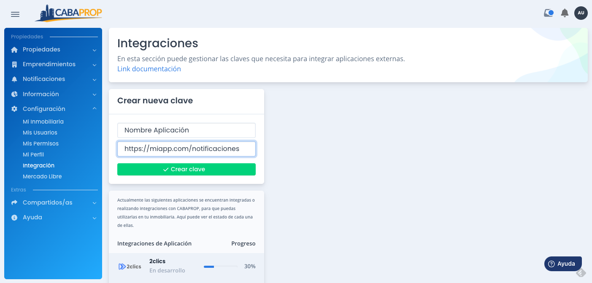
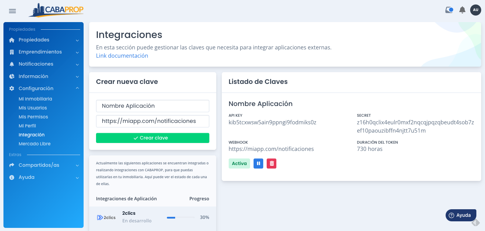

[🔙 Volver a inicio](Readme.md)

# Crear credenciales de integración

1. Inicia sesión en el portal CABAPROP en la sección "Acceso a Matriculados" utilizando tus credenciales.

2. Una vez que hayas iniciado sesión, dirígete al menú de la izquierda y selecciona "Configuración," luego elige "Integración." Asegúrate de que tu usuario tenga los permisos necesarios para acceder a esta sección.

3. Dentro de la sección de integraciones, puedes asignar un nombre descriptivo a tu integración y, si lo deseas, configurar un webhook para recibir notificaciones.

Si deseas obtener más información sobre cómo funcionan las notificaciones a través de webhooks, puedes consultar la información adicional [acá](Webhook.md).

Si tienes más texto que necesitas mejorar o alguna otra pregunta, no dudes en decírmelo. Estoy aquí para ayudarte.